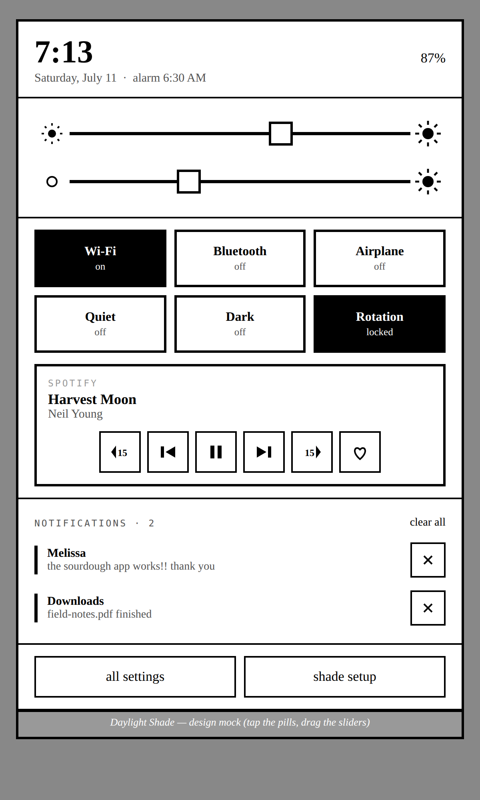

# Daylight Shade

Our own pull-down quick settings for the DC-1 — grayscale, bordered, serif,
calm — built as a tiny standalone system app instead of a SystemUI fork, so
we can iterate on it in an afternoon and carry it across the AOSP 13 → 16/17
jump.



**Play with the design:** open [`design/mock.html`](design/mock.html) in any
browser — the pills toggle, the sliders drag. It is 1:1 with what the app
draws.

## The idea (why this isn't "deep Android code")

Android's stock shade lives inside SystemUI, the OS process that owns the
status bar. Modifying it means forking AOSP, and every OS upgrade means
re-doing the fork. That's the pain we're escaping.

Daylight Shade never touches SystemUI. It is an ordinary app (48 KB, zero
dependencies, one Java package) that:

1. draws an **invisible catch strip** along the top edge of the screen;
2. when a finger drags down from it, slides **our panel** (an overlay
   window) down with the finger — brightness, warmth, six pills, media
   controls, a notification list;
3. optionally tells the OS to **ignore swipes on the stock shade**
   (`StatusBarManager.disable(DISABLE_EXPAND)`) so ours is *the* shade.

Everything the panel does goes through stable public contracts — the
window manager, the settings providers, media sessions, the notification
listener API — not SystemUI internals. That's the whole portability story:
those contracts have barely moved since Android 5, and they are still there
in AOSP 16/17 previews.

A safety property worth knowing: the "ignore the stock shade" flag is tied
to our process. If Daylight Shade ever crashes or is uninstalled, the OS
drops the flag automatically and the stock shade comes right back. We can
never brick the pull-down.

## What's in the panel (v0.1)

- **Header** — clock, date, next alarm, battery.
- **Light slider** — backlight, via `Settings.System.SCREEN_BRIGHTNESS`.
- **Warmth slider** — amber ↔ paper-white (see "the warmth hookup" below).
- **Six pills** — Wi-Fi, Bluetooth, Airplane, Quiet (do-not-disturb), Dark,
  Rotation lock. Tap toggles; long-press goes deeper. For Wi-Fi and
  Bluetooth, "deeper" means **our own picker pages inside the shade**:
  networks strongest-first with tap-to-join, paired devices with
  connect/disconnect plus find-new-device pairing. (They're young — one
  switch in shade setup falls back to the system surfaces: Android's
  compact Wi-Fi sheet, the Bluetooth settings page.) Any action an install
  isn't allowed to do directly hands off to the matching system surface —
  the panel never silently fails.
- **Media card** — whatever is playing (Spotify, Audible…): ⏮ ⏯ ⏭, ±15 s,
  and a heart that speaks both dialects — the standard rating API where
  implemented, the app's like/favorite custom action elsewhere (that's how
  Spotify does it). Seek prefers a true seek, then the app's own jump
  action, then fast-forward. Any remaining custom actions (shuffle, repeat,
  sleep timer…) show as a second row, the app's own icons re-inked to match
  the shade. Appears only while something has an active session.
- **Notifications** — our own list drawn our way (tap to open, ✕ to dismiss,
  clear all). No passthrough to the stock shade needed: the same
  notification-listener grant that powers the media card powers this.
- **Footer** — all settings · shade setup.
- **Two faces, one page** — the whole panel follows the system theme: day
  is ink on paper, night is the same page inverted (paper type on ink).
  Flip the Dark pill (or let a schedule flip it) and the open panel
  rebuilds itself to match on the spot.

`shade setup` (the app's launcher icon opens it too) is the control room: it
shows every capability as a plain sentence with a tap-to-grant button, and
lets you pick how the panel opens.

## Two modes, one APK

### Preview mode — works on any DC-1 today

Install the APK, grant four things in `shade setup` (draw over apps, modify
settings, notification access, do-not-disturb). You get: the full panel via
a **"Daylight panel" tile** in the stock quick settings, a **swipe zone just
below the status bar**, or the launcher button. Brightness, rotation, quiet,
media and notifications all work for real — and (verified on glass) so does
tapping **Bluetooth** to flip the radio; Android 13 still allows that with
plain BLUETOOTH_CONNECT. Wi-Fi / Airplane / Dark pills open their settings
surfaces (Android reserves those flips for system apps), and the in-shade
Wi-Fi *network list* is also system-reserved — scan results stay
location-gated, `neverForLocation` excluded — so in preview the Wi-Fi
picker offers the radio toggle plus an honest hand-off row to the system
list. The stock shade still owns the very top edge.

Optional, for development, from a computer:

```sh
adb shell pm grant com.daylightcomputer.shade android.permission.WRITE_SECURE_SETTINGS
```

which turns on the night-light stand-in for the warmth slider.

### Full mode — arrives with one Sol:OS build change

When the OS ships this app as a **platform-signed priv-app**, the same APK
notices its new powers and unlocks: the swipe on the status bar itself opens
*our* panel, the stock shade goes silent, and every pill flips directly.
Nothing to rebuild; `shade setup` grows the extra switches.

## The exact ask for the platform team

> Ship `shade/dist/daylight-shade.apk` (package
> `com.daylightcomputer.shade`) in the Sol:OS image:
>
> 1. **Re-sign it with the platform certificate** and install it as a
>    priv-app (e.g. `system_ext/priv-app/DaylightShade/`). In a Soong tree:
>
>    ```
>    android_app_import {
>        name: "DaylightShade",
>        apk: "daylight-shade.apk",
>        certificate: "platform",
>        privileged: true,
>        system_ext_specific: true,
>    }
>    ```
>    (plus `PRODUCT_PACKAGES += DaylightShade`)
>
> 2. **Allowlist its privileged permissions** —
>    `system_ext/etc/permissions/privapp-permissions-daylightshade.xml`:
>
>    ```xml
>    <permissions>
>      <privapp-permissions package="com.daylightcomputer.shade">
>        <permission name="android.permission.STATUS_BAR"/>
>        <permission name="android.permission.WRITE_SECURE_SETTINGS"/>
>        <permission name="android.permission.MODIFY_DAY_NIGHT_MODE"/>
>        <permission name="android.permission.NETWORK_AIRPLANE_MODE"/>
>        <permission name="android.permission.BLUETOOTH_PRIVILEGED"/>
>      </privapp-permissions>
>    </permissions>
>    ```
>    (`BLUETOOTH_PRIVILEGED` is what lets tapping a paired device in the
>    shade actually route audio to it.)
>
>    (`INTERNAL_SYSTEM_WINDOW` and `NETWORK_SETTINGS` are signature-level;
>    the platform signature from step 1 covers them.)
>
> 3. **If any call still logs a hidden-API block** (`Accessing hidden
>    method`), add the package to the hidden-API exemption list
>    (`hiddenapi-package-whitelist.xml` / the product's
>    `PRODUCT_HIDDENAPI_EXEMPT` mechanism). The app touches a handful of
>    hidden members, all listed in one file: `control/SysApi.java`.
>
> 4. **The warmth setting — answered.** Found on-glass 2026-07-11:
>    the stock slider writes `Settings.System screen_brightness_amber_rate`
>    = 256 + amber (amber 0..255; 256 = paper white, 511 = full amber; the
>    +256 sentinel must always be present). The app already drives it — it
>    just needs the system placement from step 1, since AOSP refuses
>    unknown system-table keys from non-system installs. One question
>    remains: confirm nothing else (a vendor service, a sysfs watcher)
>    needs poking after the settings write — on our test device the write
>    alone moved the backlight via the stock path.

That's the whole OS-side footprint. No SystemUI patches, no framework
changes.

## The warmth hookup

**The key is found** (first on-glass session, 2026-07-11): the DC-1's amber
backlight lives behind `Settings.System screen_brightness_amber_rate`,
encoded `256 + amber` with amber 0..255 — 256 is paper white, 511 full
amber, and the stock slider runs amber-on-the-left. `Warmth.java` knows the
key, the offset encoding, and the direction (our slider matches stock:
left = amber, right = paper white).

The remaining gate is *who may write it*: AOSP's settings provider refuses
unknown system-table keys from any non-system app — even with
WRITE_SECURE_SETTINGS granted — so the real hookup lights up exactly when
Sol:OS ships the app in the system image (the same blessing as everything
else; no extra permission needed). `Warmth.java` probes writability once
with a same-value write and reports honestly. Until then, with
`WRITE_SECURE_SETTINGS` granted, the slider drives AOSP night light as a
stand-in so the interaction can be felt today.

## Building

```sh
export ANDROID_BUILD_TOOLS=…/build-tools/33.x   # aapt2, zipalign, apksigner
export ANDROID_PLATFORM=…/platforms/android-33  # android.jar
export ANDROID_D8=…/build-tools/35.x/d8         # only if your JDK is 17+
./build.sh
```

No Gradle, no Android Studio, no dependencies — `aapt2 → javac → d8 →
apksigner`, ~3 seconds, out comes `dist/daylight-shade.apk` signed with the
club key (`../signing/dcc.keystore`). The two SDK folders come from plain
zips on `dl.google.com` (URLs in `build.sh`).

## Source map

```
app/AndroidManifest.xml            components + the three permission tiers
app/src/…/shade/
  ShadeService.java                the two overlay windows + gesture strip
  ShadeNLService.java              notification listener (media + notif list)
  MainActivity.java                "shade setup" control room
  ShadeTileService.java            the stepping-stone tile in the stock QS
  BootReceiver, PanelTrampoline…   plumbing
  Prefs.java                       strip placement, takeover switch
  ui/PanelView.java                the panel itself (header→footer)
  ui/WifiPickerView,
     BtPickerView, PickerPage      in-shade network + device pickers
  ui/InkSlider, TileButton,
     IconButton, Ui.java           the grayscale widget kit (canvas-drawn)
  control/Caps.java                live permission matrix
  control/Toggles.java             airplane/dnd/dark/rotation + hand-offs
  control/WifiNets, BtDevices      the radios, defensively (public APIs)
  control/Brightness, Warmth,
          Media.java               sliders + media session
  control/SysApi.java              ⚠ the ONLY file touching hidden APIs
design/mock.html                   interactive design mock (open in browser)
dist/daylight-shade.apk            built + club-signed, ready to sideload
```

## Performance budget

- APK: **48 KB**. Process: one, plus nothing.
- Idle: a dormant foreground service — no timers, no polling, no wakeups.
  Broadcast receivers exist only while the panel is on screen.
- The panel builds its views when it opens and lets them go when it closes;
  no bitmaps, no images, everything is drawn with six Paint calls.

## When things go wrong (the failure story)

Designed so the worst case is always "the stock shade comes back," never a
broken tablet:

- **If the app crashes**, three independent layers restore normality:
  the OS removes a dead process's windows and drops its "silence the stock
  shade" flag automatically; our own crash handler *also* hands the shade
  back explicitly before dying; and the service auto-restarts a moment
  later. The user sees, at worst, the stock shade for a few seconds.
- **If it crashes repeatedly** (3 times in 15 minutes), a crash-loop
  breaker trips: the catch strip and takeover switch themselves off, the
  stock shade stays in charge, and `shade setup` shows a plain-language
  note about what happened. No crash loop can hold the pull-down hostage.
- **If the panel ever freezes**, the launcher icon (`shade setup`) is an
  ordinary activity that does not depend on the service — it always opens,
  and every switch to stand down is in there.
- **Offline / airplane mode is a non-event**: the APK does not even declare
  the INTERNET permission, so it provably makes zero network calls.
  Everything — sliders, pills, media, notifications, pickers — is local.
- **Uninstalling reverts everything.** We never modify system files; every
  change we make is an ordinary setting the OS owns.
- **Boot is safe**: the boot receiver starts one dormant service and only
  when a gesture surface is actually enabled; there is nothing that can
  loop or block startup.

## Honesty box (current status)

- ✅ Compiles clean against the real Android 13 SDK; APK builds, aligns,
  signs, verifies.
- ✅ **Ran the full on-glass protocol on a real DC-1** (2026-07-11, Sol:OS
  AOSP 13): panel renders first try; swipe zone, scrim/BACK close, pills
  (Quiet/Rotation flip in place, Bluetooth genuinely toggles the radio,
  Airplane/Dark hand off), live notification list (post/dismiss/clear
  logic), live dark-mode rebuild, force-stop recovery, airplane drill,
  landscape, reboot re-arm — all pass. Findings + fixes from that session:
  `shade-test-report.md`.
- ✅ **The warmth key is discovered** (`screen_brightness_amber_rate`,
  256+amber) — see "The warmth hookup". Writing it needs system placement,
  so the real amber drive ships with the blessing; the night-light
  stand-in covers preview.
- ⚠️ Still unverified: gesture *feel* under a real finger, the media card
  against live Spotify (heart/extras), Bluetooth pairing end-to-end, and
  whether night-light tinting is even visible on this backlight — all
  waiting on hands and eyes rather than adb.
- Deliberately **not on the club shelf yet** — Anjan calls that step after
  the feel check.

## Porting to AOSP 16/17 (the plan we're buying into)

The app deliberately depends on boring, stable contracts. When Sol:OS jumps:

1. Recompile against the new platform (`--target-sdk-version` bump).
2. Audit `SysApi.java` (3 reflective calls) and the two window-type ints in
   `ShadeService` — that's the entire hidden-API surface, kept in one place
   on purpose.
3. Known 14+ deltas, all small: foreground services want a
   `foregroundServiceType`; `TileService.startActivityAndCollapse` takes a
   `PendingIntent`; `BluetoothAdapter.enable()` goes away for non-system
   callers (we're system by then). Each is a guarded one-liner.

SystemUI's own quick-settings rewrite in newer AOSP never touches us —
which is exactly the point.

## Where this can go next

The living queue — native Wi-Fi/Bluetooth pickers, a grayscale Settings
re-theme, our own status bar, warmth scheduling, reading-light presets and
more, each with its dependency and rough size — is **[ROADMAP.md](ROADMAP.md)**.
